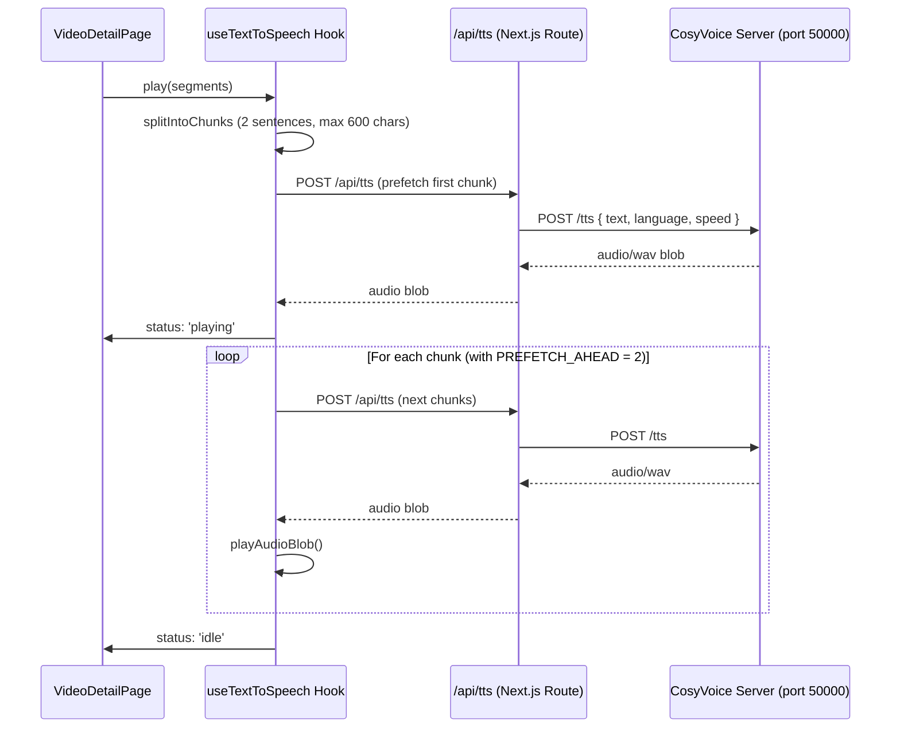

# Architecture

This document describes the overall architecture of the YouTube Video Viewer, with a focus on the NocoDB v2 integration, data flow, and key modules.

## System Overview

- Next.js 15 (App Router) with Server Components for fast, SEO-friendly rendering.
- TypeScript across the stack.
- Tailwind CSS + shadcn/ui for UI primitives and consistent styling.
- NocoDB v2 as the backend datastore exposed via REST.
- Axios-based API client in `src/features/videos/api/nocodb.ts` with strict Zod validation and robust preprocessing of NocoDB responses.
- Vitest for unit tests. React Testing Library for component tests.

## High-Level Data Flow

```mermaid
sequenceDiagram
  participant UI as UI (Pages/Components)
  participant Client as NocoDB Client (src/features/videos/api/nocodb.ts)
  participant Noco as NocoDB API (v2)
  participant Cache as Simple Cache (src/features/videos/api/cache.ts)

  UI->>Client: fetchVideos({ sort, fields, tagSearchQuery })
  Client->>Cache: getFromCache(key?)
  alt Not cached or list endpoints
    Client->>Noco: GET /api/v2/tables/{tableId}/records?limit&offset&sort&fields&where
    Noco-->>Client: { list, pageInfo }
    Client->>UI: Zod-validated videos + pageInfo
  else Cached single video
    Cache-->>Client: Video
    Client->>UI: Cached video
  end

  UI->>Client: fetchVideoByVideoId(videoId)
  Client->>Cache: getFromCache(videoId)
  alt Not cached
    Client->>Noco: GET /api/v2/tables/{tableId}/records?where=(VideoID,eq,<id>)&limit=1
    Noco-->>Client: { list: [video] }
    Client->>Cache: setInCache(videoId, video)
    Client->>UI: Zod-validated video
  else Cached
    Cache-->>Client: Video
    Client->>UI: Video
  end

  UI->>Client: updateVideo(recordIdOrVideoId, data)
  Client->>Client: resolveNumericId (may call fetchVideoByVideoId)
  Client->>Noco: PATCH /api/v2/tables/{tableId}/records/{rowId}
  alt rowId missing/404
    Client->>Noco: PATCH /api/v2/tables/{tableId}/records/{Id}
    alt numeric path 404
      Client->>Noco: PATCH /api/v2/tables/{tableId}/records (filter/records payload)
  end
  Noco-->>Client: Updated record
  Client->>Cache: Update cache (VideoID and Id)
  Client->>UI: Updated video

  UI->>Client: deleteVideo(recordIdOrVideoId)
  Client->>Client: resolveNumericId
  Client->>Noco: DELETE /api/v2/tables/{tableId}/records/{rowId}
  alt rowId missing/404
    Client->>Noco: DELETE /api/v2/tables/{tableId}/records/{Id}
    alt numeric path 404
      Client->>Noco: DELETE /api/v2/tables/{tableId}/records (filter/rows payload)
  end
  Noco-->>Client: 204 No Content
  Client->>Cache: Invalidate cache
  Client->>UI: void
```

## Key Modules

- `src/features/videos/api/`
  - `config.ts` resolves the environment configuration and keeps overrides consistent.
  - `table-metadata.ts` normalises table identifiers and caches metadata lookups.
  - `schemas.ts` defines the Zod contracts for list and detail views.
  - `video-service.ts` exposes `fetchVideos`, `fetchAllVideos`, and navigation helpers.
  - `record-utils.ts` centralises caching of single records and identifier lookups.
  - `mutations.ts` contains the update and delete flows with shared normalisers.

- `src/features/videos/components/`
  - Grid/list rendering, `StarRating`, and detail page client view.

- `src/app/`
  - Server components (e.g. `src/app/page.tsx`, `src/app/video/[videoId]/page.tsx`) fetch data on the server and pass to client components.

- `src/features/videos/api/cache.ts`
  - Minimal cache to store single video responses by `VideoID`/`Id`.

## NocoDB Integration

- Environment variables (IDs, not names):
  - `NC_URL` – e.g. `http://localhost:8080`
  - `NC_TOKEN` – API token
  - `NOCODB_PROJECT_ID` – e.g. `phk8vxq6f1ev08h`
  - `NOCODB_TABLE_ID` – canonical v2 hash (e.g. `m1lyoeqptp7fq5z`) required by all requests.
  - `NOCODB_TABLE_NAME` – optional slug (useful for logging or admin context only).

- Endpoints (primary):
  - Metadata discovery: `GET {NC_URL}/api/v2/meta/projects/{projectId}/tables`
  - Table metadata lookup: `GET {NC_URL}/api/v2/tables/{tableId}`
  - `GET {NC_URL}/api/v2/tables/{tableId}/records`
  - `PATCH {NC_URL}/api/v2/tables/{tableId}/records/{rowIdOrId}` (row-specific v2 endpoint)
  - `DELETE {NC_URL}/api/v2/tables/{tableId}/records/{rowIdOrId}` (row-specific v2 endpoint)

- Headers:
  - `xc-token: <NC_TOKEN>`
  - `Content-Type: application/json`

- Filtering examples:
  - Tag search: `(Hashtags,ilike,%ai%)~and(Hashtags,ilike,%finance%)`
  - Single video: `(VideoID,eq,dQw4w9WgXcQ)`

## Validation and Preprocessing

- Zod ensures response correctness. If parsing fails, a `NocoDBValidationError` is thrown with detailed issues.
- Preprocessors in `nocodb.ts`:
  - `stringToArrayOrNullPreprocessor` – newline-separated strings -> `string[]`.
  - `stringToLinkedRecordArrayPreprocessor` – comma-separated or mixed input -> `{ Title?: string; name?: string }[]`.
  - `emptyObjectToNull` – normalizes `{}` to `null`.
  - `ThumbHigh` – transformed to one URL string (or `null`).
  - Date fields use `z.coerce.date()` for robust ISO parsing.

## Error Handling

- Axios errors converted via `NocoDBRequestError` with included status and response data.
- Validation errors throw `NocoDBValidationError` with Zod issues.
- All client functions log key request/response context for easier debugging during development.

## Performance Considerations

- Use `fields` selection for list endpoints to reduce payload.
- Use server components to pre-render and stream content.
- Cache single-video fetches and keep list requests efficient with pagination.

## Security Notes

- Never commit real tokens. Use `.env.local` and `.env.example`.
- Auth is via `xc-token` header; do not add tokens to URLs.

## Directory Structure (Relevant)

```
yt-viewer/
├─ src/
│  ├─ app/
│  │  ├─ api/tts/
│  │  │  └─ route.ts              # TTS proxy endpoint
│  │  └─ video/[videoId]/
│  │     └─ VideoDetailPageContent.tsx  # TTS UI controls
│  ├─ features/
│  │  └─ videos/
│  │     ├─ api/
│  │     └─ components/
│  └─ shared/
│     ├─ components/
│     ├─ hooks/
│     │  └─ use-text-to-speech.ts  # TTS React hook
│     └─ utils/
├─ scripts/
│  └─ ensure-video-state.ts
├─ tts-app.sh                      # Combined startup script
├─ TTS_README.md                   # TTS documentation
├─ README.md
├─ SETUP.md
├─ AGENTS.md
└─ architecture.md (this file)

~/CosyVoice/                       # TTS Server (separate repo)
├─ tts_server.py                   # FastAPI TTS server
├─ start_tts_server.sh
└─ pretrained_models/
   └─ Fun-CosyVoice3-0.5B/
```

## Text-to-Speech (TTS) Architecture

The application includes a TTS feature powered by CosyVoice 3 for reading video content aloud.

### TTS Data Flow



### TTS Components

- **`src/shared/hooks/use-text-to-speech.ts`**
  - React hook managing TTS state (idle, preparing, playing, paused, error)
  - Prefetch-ahead buffering (2 segments) for gapless playback
  - Automatic language detection (German/English)
  - Text chunking (2 sentences per chunk, max 600 chars)
  - Markdown stripping before synthesis

- **`src/app/api/tts/route.ts`**
  - Same-origin proxy to avoid CORS/mixed-content issues
  - Streams audio response from CosyVoice server
  - Supports `/api/tts` (single) and `/api/tts/prepare` (batch) endpoints

- **CosyVoice Server** (`~/CosyVoice/tts_server.py`)
  - FastAPI server on `http://127.0.0.1:50000`
  - Model: Fun-CosyVoice3-0.5B (multilingual)
  - Hash-based audio caching
  - Endpoints: `/health`, `/tts`, `/prepare`, `/audio/{filename}`, `/cache`

### TTS Performance Optimizations

- **Prefetch-ahead**: Fetches next 2 chunks while current plays
- **Lazy Audio initialization**: `<audio>` element created only when user clicks "Read Aloud"
- **Server-side caching**: CosyVoice caches generated audio by text hash
- **Batch preparation**: `/prepare` endpoint pre-generates all chunks
- **First-chunk priority**: Extended timeout (120s) for first segment to handle model warm-up

### Startup Script

`./tts-app.sh` manages both services:
- `start` / `stop` / `restart` – all services
- `start-tts` / `stop-tts` – TTS server only
- `start-app` / `stop-app` – Next.js only
- `status` – health check
- `logs tts|nextjs` – view logs
- `-v` flag for verbose output

## Future Improvements

- Add E2E (Playwright) for update/delete flows.
- Add Storybook for UI primitives.
- Expand caching strategy if needed (stale-while-revalidate patterns, etc.).
- Add TTS voice selection UI for different speakers/accents.
