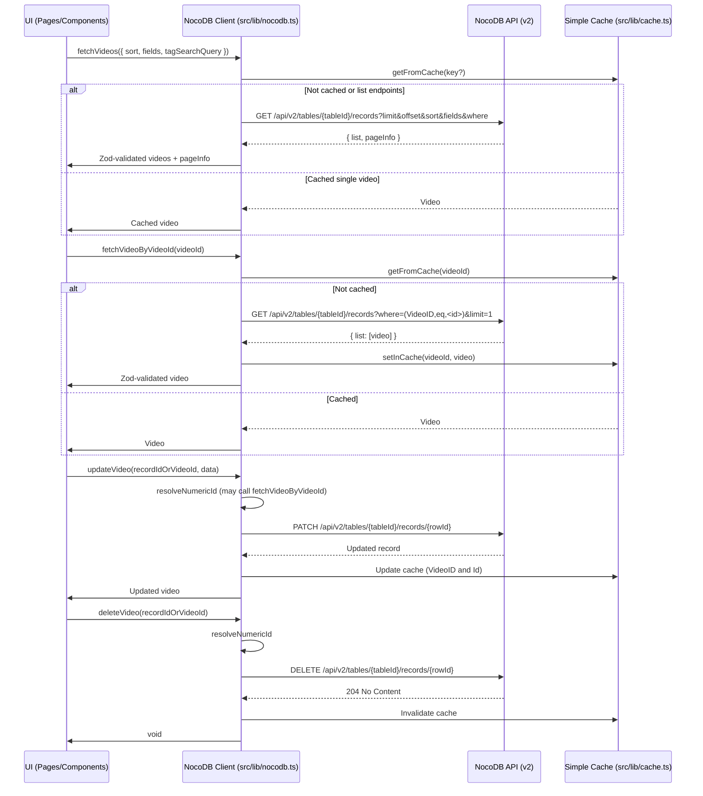

# Architecture

This document describes the overall architecture of the YouTube Video Viewer, with a focus on the NocoDB v2 integration, data flow, and key modules.

## System Overview

- Next.js 15 (App Router) with Server Components for fast, SEO-friendly rendering.
- TypeScript across the stack.
- Tailwind CSS + shadcn/ui for UI primitives and consistent styling.
- NocoDB v2 as the backend datastore exposed via REST.
- Axios-based API client in `src/lib/nocodb.ts` with strict Zod validation and robust preprocessing of NocoDB responses.
- Vitest for unit tests. React Testing Library for component tests.

## High-Level Data Flow



## Key Modules

- `src/lib/nocodb.ts`
  - `getNocoDBConfig()` reads `NC_URL`, `NC_TOKEN`, `NOCODB_PROJECT_ID`, `NOCODB_TABLE_ID`.
  - `fetchVideos()` with pagination, sort, optional `fields`, and tag search via `where` (ilike on `Hashtags`).
  - `fetchVideoByVideoId()` with `(VideoID,eq,<videoId>)`.
  - `updateVideo()`/`deleteVideo()` with automatic numeric Id resolution.
  - Zod schemas (`videoSchema`, `videoListItemSchema`) + preprocessors for robust parsing.

- `src/components/`
  - Grid/list rendering, `StarRating`, and detail page client view.

- `src/app/`
  - Server components (e.g. `src/app/page.tsx`, `src/app/video/[videoId]/page.tsx`) fetch data on the server and pass to client components.

- `src/lib/cache.ts`
  - Minimal cache to store single video responses by `VideoID`/`Id`.

## NocoDB Integration

- Environment variables (IDs, not names):
  - `NC_URL` – e.g. `http://localhost:8080`
  - `NC_TOKEN` – API token
  - `NOCODB_PROJECT_ID` – e.g. `phk8vxq6f1ev08h`
  - `NOCODB_TABLE_ID` – e.g. `m1lyoeqptp7fq5z`

- Endpoints (primary):
  - `GET {NC_URL}/api/v2/tables/{tableId}/records`
  - `PATCH {NC_URL}/api/v2/tables/{tableId}/records/{rowId}`
  - `DELETE {NC_URL}/api/v2/tables/{tableId}/records/{rowId}`

- Headers:
  - `xc-token: <NC_TOKEN>`
  - `Content-Type: application/json`

- Filtering examples:
  - Tag search: `(Hashtags,ilike,%ai%)~and(Hashtags,ilike,%finance%)`
  - Single video: `(VideoID,eq,dQw4w9WgXcQ)`

## Validation and Preprocessing

- Zod ensures response correctness. If parsing fails, a `NocoDBValidationError` is thrown with detailed issues.
- Preprocessors in `nocodb.ts`:
  - `stringToArrayOrNullPreprocessor` – newline-separated strings -> `string[]`.
  - `stringToLinkedRecordArrayPreprocessor` – comma-separated or mixed input -> `{ Title?: string; name?: string }[]`.
  - `emptyObjectToNull` – normalizes `{}` to `null`.
  - `ThumbHigh` – transformed to one URL string (or `null`).
  - Date fields use `z.coerce.date()` for robust ISO parsing.

## Error Handling

- Axios errors converted via `NocoDBRequestError` with included status and response data.
- Validation errors throw `NocoDBValidationError` with Zod issues.
- All client functions log key request/response context for easier debugging during development.

## Performance Considerations

- Use `fields` selection for list endpoints to reduce payload.
- Use server components to pre-render and stream content.
- Cache single-video fetches and keep list requests efficient with pagination.

## Security Notes

- Never commit real tokens. Use `.env.local` and `.env.example`.
- Auth is via `xc-token` header; do not add tokens to URLs.

## Directory Structure (Relevant)

```
yt-viewer/
├─ src/
│  ├─ app/
│  │  └─ video/[videoId]/
│  ├─ components/
│  └─ lib/
│     └─ nocodb.ts
├─ README.md
├─ prompt.md
├─ status.md
├─ agent.md
└─ architecture.md (this file)
```

## Future Improvements

- Add E2E (Playwright) for update/delete flows.
- Add Storybook for UI primitives.
- Expand caching strategy if needed (stale-while-revalidate patterns, etc.).
